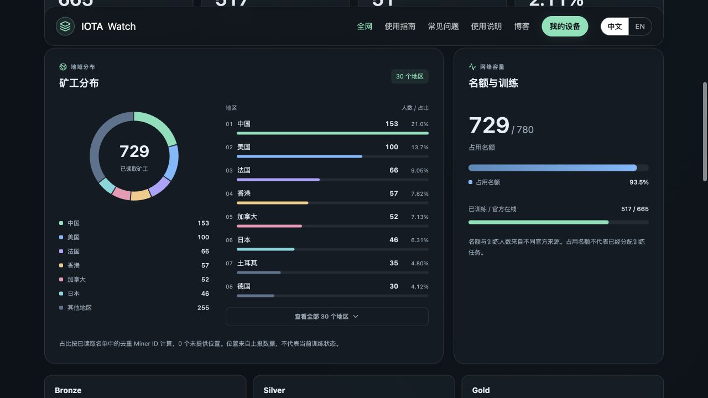

# IOTA Watch

开源的 **IOTA Train at Home 多设备监控面板**，在浏览器中查看训练状态、收益、历史趋势与全网矿工分布。

**[官网](https://iotahome.site) · [我的设备](https://iotahome.site/zh/app) · [全网现况](https://iotahome.site/zh/network) · [博客](https://iotahome.site/zh/blog) · [English](https://iotahome.site/en)**

IOTA Watch is an open-source, bilingual dashboard for monitoring Macrocosmos IOTA Train at Home devices and public network data. It is an independent community tool for the Bittensor SN9 ecosystem, not an IOTA Layer 1 wallet.



截图展示矿工分布和网络容量，数字为截图时的官方数据。

## 功能

- **多设备监控**：通过公开 Miner ID 添加、命名和查看设备，按有贡献、等待任务、需检查、待确认筛选。
- **收益记录**：今日、累计、已支付、待支付、冻结与最低支付金额；同时显示带来源和时间的美元估价。
- **训练历史**：按日、周、月查看训练 Token、吞吐量和累计 Token，缺失数据保留为空缺。
- **全网可视化**：地区分布环图、矿工人数排行、名额占用、任务进度与档位概览。
- **数据时效**：独立显示各来源的读取时间、覆盖率、旧数据与部分失败提示。
- **设备清单**：未登录时在当前浏览器保存最多 3 台；Google 登录后账号最多绑定 10 台；支持 JSON 导入导出。
- **中英文内容**：使用说明与博客，包含文章目录、官方资料来源及 AI 可读取的 Markdown 版本。
- **手机适配**：响应式卡片、图表和导航菜单。

网页读取公开数据，不控制训练应用，不配置收款地址，也不需要私钥或助记词。

## 本地运行

需要 **Node.js 22.12 或更高版本**（推荐 Node.js 24 LTS）和 npm。

```sh
git clone https://github.com/molimao/iota.git
cd iota
npm ci
cp .env.example .env.local
# 在 .env.local 中填写自己的 Supabase 项目配置
npm run dev
```

启动后打开 **http://localhost:8080/zh/app**。若提示端口占用，先关闭占用 8080 的进程。

本项目使用 React、TypeScript、TanStack Start / Router / Query、Vite、Tailwind CSS、Recharts 和 Supabase。

### 环境配置

`.env.example` 提供客户端与服务端配置的字段。仓库现有 `.env` 是 Lovable 生成的公开客户端配置；复刻或部署自己的实例时，请使用 `.env.local` 覆盖为自己的 Supabase 项目。

- `VITE_SUPABASE_URL` / `VITE_SUPABASE_PUBLISHABLE_KEY`：浏览器使用的项目地址和公开 publishable key。
- `SUPABASE_URL` / `SUPABASE_PUBLISHABLE_KEY`：服务端使用的对应配置。
- Supabase 数据表和访问策略位于 [`supabase/migrations`](supabase/migrations)，按文件时间顺序应用到自己的项目。
- 当前 Google 登录通过 Lovable Cloud OAuth 接入。独立部署时，需要配置自己的 OAuth 与回调地址，并按自己的认证方案适配 [`src/integrations/lovable/index.ts`](src/integrations/lovable/index.ts)。

私有配置放在未跟踪的本地环境文件或部署平台的环境变量中。不要把 service role key、OAuth secret、用户会话或钱包凭据加入源码。

### 检查与构建

```sh
npx vitest run
npx tsc --noEmit
npm run build
```

官方 API 检查为可选项：

```sh
IOTA_LIVE_CHECK=1 npx vitest run src/lib/official-api.live.test.ts
```

该检查只在内存中选取官方公开名单中的 ID，不写入设备清单或源码。

## 数据来源与口径

公开训练数据来自 Macrocosmos 官方 API：`https://iota-web.api.macrocosmos.ai/mainnet`。服务端只代理固定允许的端点，校验响应、限制并发、设置超时与缓存，并保留失败前的有效数据。

- 设备状态约每 30 秒检查一次；官方矿工名单缓存 60 秒。官方采样时间与本站成功读取时间分开显示，采样较旧不能单独证明设备离线。
- 收益约每 2 分钟检查一次；官方收益数据缓存 5 分钟。今日收益按香港时间 00:00 起的 `pending`、`settled` 记账记录求和，排除冻结与未来记录。
- 名单扫描不完整时不把设备判为缺席；数据缺失不填成零；部分收益明确标注覆盖率。
- 全网矿工按 Miner ID 去重，地区别名合并后再计算人数和占比。名额、训练活动和收益来自不同来源。
- 美元金额为公开市场估价，不是结算金额。上游限流或拒绝访问时，页面保留有效旧数据并显示提示。

官方资料：[TAH 用户指南](https://docs.macrocosmos.ai/product-and-services/tah/tah-user-guide) · [官方 FAQ](https://docs.macrocosmos.ai/product-and-services/tah/faqs)。

## 项目结构

| 路径                  | 内容                                     |
| --------------------- | ---------------------------------------- |
| `src/components`      | 设备监控、全网视图、历史图表             |
| `src/components/site` | 中英文页面、博客、使用说明与 SEO         |
| `src/hooks`           | 查询、登录、设备清单状态                 |
| `src/lib`             | 官方 API、数据校验、收益与状态计算、测试 |
| `src/routes`          | TanStack 页面路由                        |
| `src/server.ts`       | 服务端响应、抓取资源与错误处理           |
| `supabase/migrations` | 账号设备表、行级访问策略与设备数量限制   |

## 部署与内容维护

完整步骤见 **[部署指南](docs/DEPLOYMENT.md)**，包含 Supabase 配置、数据库初始化、Cloudflare 发布与常见问题。

官网部署在 Lovable / Cloudflare。仓库 `main` 与 [Lovable 项目](https://lovable.dev/projects/5854fd0c-7c2c-425c-a833-b540ffe023bd) 同步；同步代码后在 Lovable 发布。

独立部署目前需要配置自己的 Supabase，并适配 Google OAuth；完整账号功能尚未做到无需改动即可一键部署。当前官网规范地址为 `iotahome.site`；更换域名时，更新 [`src/lib/site.ts`](src/lib/site.ts) 的域名配置，以及生成的抓取文件。

文章维护在 `src/components/site/articles.ts` 和 `blog-posts.ts`。正文、结构化信息、Markdown、网站地图共用文章元数据。修改内容后，保持 `public/sitemap.xml`、`robots.txt`、`llms.txt`、`llms-full.txt` 与 `src/lib/crawl.ts` 的生成结果一致；文章日期只在内容实际更新时调整。

## 贡献

欢迎提交 [Issue](https://github.com/molimao/iota/issues) 或 Pull Request。报告问题时请说明页面、复现步骤和数据来源提示，避免附带私人账号数据或凭据。数据相关改动应覆盖未知值、零值、部分覆盖及缓存失败的情况。

## 开源许可

本项目采用 [MIT License](LICENSE)。第三方依赖保留各自的许可；Macrocosmos、IOTA Train at Home 和其他产品名称属于各自权利人。

## Mac 本地工具下载

官网 [工具下载](https://iotahome.site/zh/downloads) 提供 IOTA Train at Home 状态查看、优化启动和异常守护工具。源码与安装、停止、卸载说明在 [tools/iota-local/README.md](tools/iota-local/README.md)。已在 Apple Silicon Mac、官方客户端 3.7.0 上使用，要求 `/usr/bin/python3` 为 Python 3.9+；其他版本未验证。

公开发布包仅包含固定清单中的脚本、说明和 MIT 许可证，不包含本机状态、日志、账号或钱包文件。安装会注册当前用户的登录守护及异常自动重启；网页监控本身仍只读。

修改脚本后运行 `python3 scripts/package-iota-tools.py`，它会生成 ZIP、SHA-256、版本元数据及单独的状态查看脚本。校验：`PYTHONDONTWRITEBYTECODE=1 python3 tools/tests/test_iota_tools.py`，不安装服务、不启动或重启 IOTA。

## 搜索引擎更新提交

Google Search Console 使用 `https://iotahome.site/sitemap.xml`；新增的重要页面可在网址检查中请求编入索引。不要使用已废弃的 sitemap ping 接口，也不要将普通文章提交到仅适用于招聘和直播页面的 Google Indexing API。

官网发布完成后，运行 `npm run seo:submit`，通过 IndexNow 将线上网站地图中的可索引页面通知 Bing 等支持该协议的搜索引擎。`node scripts/submit-indexnow.mjs --check` 只检查线上地图和归属文件，不提交。脚本会拒绝非官网地址及 app/account 页面；成功接收不表示已经收录。

`scripts/indexnow.json` 和对应的根目录 TXT 是协议要求公开的站点归属校验标识，不是私密 API 密钥、钱包密钥或管理凭证。
